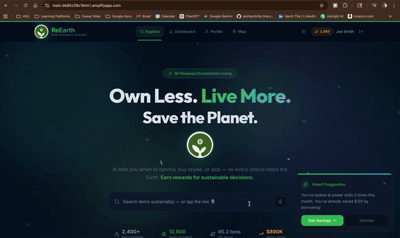
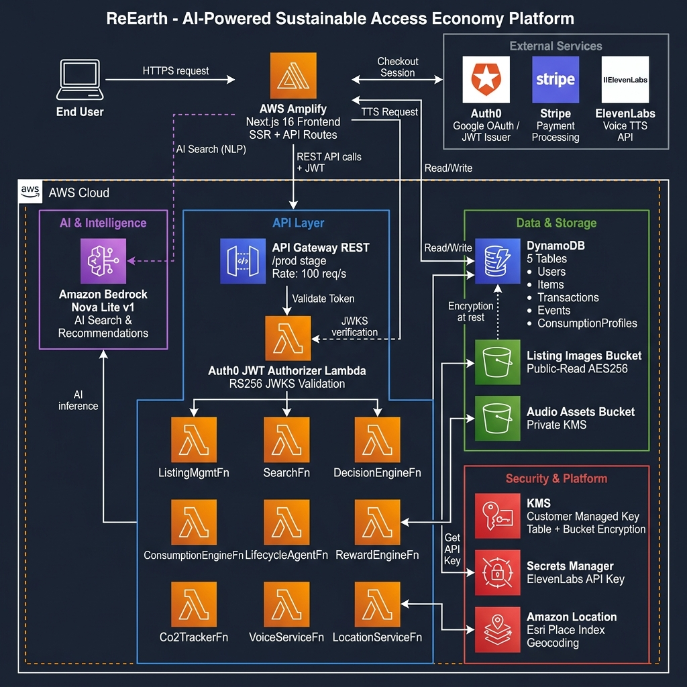

<h1 align="center">
  <br/>
  ReEarth — AI-Powered Sustainable Access Economy
</h1>

<p align="center">
  <strong>Own less. Live more. Save the planet.</strong><br/>
  An intelligent sharing platform that uses AI to tell you when to borrow, buy resale, or skip a purchase entirely — rewarding every sustainable decision.
</p>

<p align="center">
  
  
  
  
  
  
  
</p>

---

## 🎬 Live Demo



> **[PLACEHOLDER]** Please provide a GIF or screenshot of the running application and save it as `docs/media/user-interface.gif`. A screen recording of navigating the home page, searching for an item, viewing a listing, and completing checkout is ideal.

---

## 📋 Table of Contents

| Index | Description |
| :---------------------------------------------------- | :------------------------------------------------------- |
| [High-Level Architecture](#high-level-architecture) | System components, data flow, and AWS services |
| [Deployment Guide](./docs/deploymentGuide.md) | Full step-by-step deployment instructions |
| [User Guide](./docs/userGuide.md) | How to use the platform as an end user |
| [API Documentation](./docs/APIDoc.md) | All REST API endpoints with request/response shapes |
| [Architecture Deep Dive](./docs/architectureDeepDive.md) | Detailed technical architecture explanation |
| [Modification Guide](./docs/modificationGuide.md) | How to extend or customize the platform |
| [Directories](#directories) | Project directory structure explained |
| [Credits](#credits) | Team members and acknowledgements |

---

## 🏗 High-Level Architecture

ReEarth is a **full-stack serverless platform** built on AWS. The frontend is a **Next.js** app deployed on **AWS Amplify**, which talks directly to **AWS DynamoDB** and **Amazon Bedrock** for AI search. Authenticated actions flow through an **AWS API Gateway** backed by **12 Python Lambda functions**, all protected by an **Auth0 JWT authorizer**. Product images live in **S3**, voice narrations are generated by **ElevenLabs**, and payments are processed by **Stripe**.



> **[PLACEHOLDER]** Please create an architecture diagram and save it as `docs/media/architecture.png`. The diagram should show:
> - User → AWS Amplify (Next.js Frontend)
> - Frontend → Amazon Bedrock (AI Search)
> - Frontend → DynamoDB (listings, profiles, transactions)
> - Frontend → Stripe (checkout)
> - Frontend → ElevenLabs (voice TTS)
> - Frontend → AWS API Gateway → 12 Lambda Functions
> - Auth0 JWT Authorizer on API Gateway
> - S3 buckets (listing images, audio assets)
> - Amazon Location Service (geocoding)
> - AWS Secrets Manager (ElevenLabs key)
> - AWS KMS (encryption)

📖 **[Full Architecture Deep Dive →](./docs/architectureDeepDive.md)**

---

## 🚀 Quick Links

| Document | Purpose |
| :--- | :--- |
| [📦 Deployment Guide](./docs/deploymentGuide.md) | Deploy backend (CDK) + frontend (Amplify) from scratch |
| [👤 User Guide](./docs/userGuide.md) | Browse listings, search with voice, borrow/buy, track your eco-impact |
| [🔌 API Documentation](./docs/APIDoc.md) | 20+ REST endpoints for listings, rewards, CO₂, voice, and more |
| [🛠 Modification Guide](./docs/modificationGuide.md) | Add new categories, swap AI models, extend the reward system |

---

## 📁 Directories

```
InnovationHacks/
├── backend/                        # AWS CDK infrastructure (TypeScript)
│   ├── bin/                        # CDK app entry point
│   ├── lambda/                     # All 12 Python Lambda function handlers
│   │   ├── auth_trust/             # Auth0 callback + user profile sync
│   │   ├── authorizer/             # JWT token validation (Auth0 RS256)
│   │   ├── co2_tracker/            # CO₂ savings calculator per transaction
│   │   ├── consumption_engine/     # User behavior tracking + eco-score
│   │   ├── decision_engine/        # AI borrow/buy/skip recommendation (Bedrock)
│   │   ├── lifecycle_agent/        # Nudges, return reminders, suggestions
│   │   ├── listing_management/     # CRUD for marketplace listings
│   │   ├── location_service/       # Geocoding + nearby listings (Amazon Location)
│   │   ├── reward_engine/          # Green points award, redeem, balance
│   │   ├── search/                 # Backend search handler
│   │   ├── shared/                 # Shared utilities and helpers
│   │   └── voice_service/          # ElevenLabs TTS + audio storage in S3
│   ├── lib/                        # CDK stack definition
│   │   └── sustainable-access-platform-stack.ts
│   ├── scripts/                    # Data seeding + image upload scripts
│   │   ├── seed_items.py           # Seeds sample listings into DynamoDB
│   │   └── upload_images_to_s3.py  # Uploads product images to S3
│   └── tests/                      # CDK stack unit tests
├── docs/                           # Documentation (this folder)
│   ├── media/                      # Screenshots, GIFs, architecture diagrams
│   ├── architectureDeepDive.md
│   ├── deploymentGuide.md
│   ├── userGuide.md
│   ├── APIDoc.md
│   └── modificationGuide.md
├── frontend/                       # Next.js 16 app (deployed on AWS Amplify)
│   ├── public/                     # Static assets (logo, product images)
│   └── src/app/
│       ├── api/                    # Next.js API routes (server-side)
│       │   ├── listings/           # AI-powered product search (Bedrock)
│       │   ├── checkout/           # Stripe checkout session creation
│       │   ├── dashboard/          # Eco-stats aggregation
│       │   ├── profile/            # User profile CRUD
│       │   ├── transactions/       # Transaction history
│       │   └── voice/tts/          # ElevenLabs TTS proxy
│       ├── components/             # Shared React components
│       ├── listings/[id]/          # Product detail page
│       ├── dashboard/              # User eco-impact dashboard
│       ├── map/                    # Nearby listings map view
│       ├── onboarding/             # New user setup flow
│       ├── checkout/               # Payment + success pages
│       └── profile/                # User profile page
└── README.md
```

**Key directories explained:**

1. **`backend/lambda/`** — Twelve independent Python microservices. Each handles a single domain (auth, search, rewards, etc.) with least-privilege IAM permissions.
2. **`backend/lib/`** — Single CDK TypeScript stack that provisions all AWS infrastructure: 5 DynamoDB tables, 2 S3 buckets, API Gateway, 12 Lambdas, KMS key, Secrets Manager, Amazon Location Place Index.
3. **`backend/scripts/`** — Run these after every `cdk deploy` to re-seed the DynamoDB Items table and upload product images to S3.
4. **`frontend/src/app/api/`** — Next.js server-side API routes. These run inside Amplify's server-rendered environment and call AWS services directly using IAM credentials from Amplify's environment.
5. **`frontend/src/app/components/`** — Reusable UI: `Navigation`, `ListingCard`, `SearchBar`, `RecommendationBadge`, `NudgeAlert`, and more.

---

## 🌟 Key Features

| Feature | Technology |
| :--- | :--- |
| 🤖 **AI Search** | Amazon Bedrock (Nova Lite) — understands natural language queries |
| 🎙 **Voice Search** | ElevenLabs TTS + Browser Speech Recognition |
| 🔐 **Authentication** | Auth0 (Google sign-in) + JWT Lambda Authorizer |
| 💳 **Payments** | Stripe Checkout (borrow by day or buy resale) |
| 🌿 **Eco-Score** | Real-time CO₂ tracking and sustainability scoring |
| 🏆 **Rewards** | Green points for every sustainable decision |
| 🗺 **Map View** | Amazon Location Service — nearest listings |
| 📊 **Dashboard** | Personal consumption analytics and impact stats |
| 🔒 **Security** | KMS encryption, PITR on all DynamoDB tables, SSL enforced |

---

## 📄 License

This project is licensed under the **MIT License**. See [LICENSE](./LICENSE) for details.

---

## 🙏 Credits

This application was architected and developed by:

- <a href="[INSERT_LINKEDIN_URL_1]" target="_blank">[INSERT_CONTRIBUTOR_1_NAME]</a>
- <a href="[INSERT_LINKEDIN_URL_2]" target="_blank">[INSERT_CONTRIBUTOR_2_NAME]</a>

Built for **InnovationHacks 2.0** — pushing the boundaries of AI-driven sustainability.

> **[PLACEHOLDER]** Replace the contributor names and LinkedIn URLs above with actual team member information.
